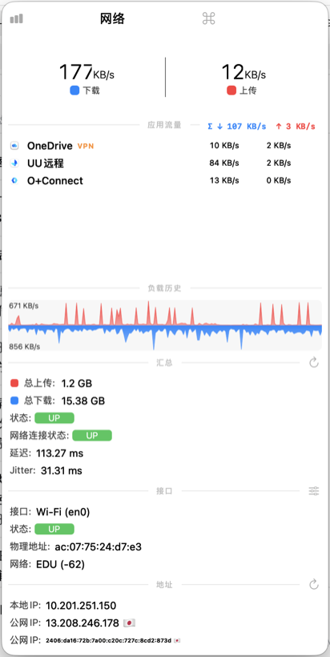

# StatsFlow

基于 [exelban/Stats](https://github.com/exelban/stats) 的分支版本，为网络模块加入 NetBar 风格的按应用网络流量展示。macOS 菜单栏系统监控，其余模块（CPU、内存、磁盘、电池等）保持上游行为不变。

分支基于上游提交 `d4c10b8`（2026-09-02），改动集中在网络模块与共用弹窗组件，共 9 个文件。本仓库为上游的衍生作品，沿用其 MIT 许可。

## 功能

- 网络弹窗内列出当前占用网络的应用（默认前 8 个），显示各自的上行/下行速率
- 按父应用聚合：helper 子进程（如 Google Chrome 的各类 Helper）合并至主应用名下，行内 tooltip 显示合并的进程数
- VPN 归因：凡应用流量经系统代理端口或隧道接口（utun/tap/ppp/ipsec）传输，应用名旁标注橙色 VPN 标签
- 代理与隧道工具（Clash、mihomo、surge、tunnel 类进程等）视为基础设施，不出现在应用列表
- 数值平滑：显示值按指数滑动平均过渡（α=0.4），列表排序与入选基于应用级平滑流量（α=0.3），行序与数字不再逐秒抖动
- 应用图标解析：优先进程图标，失败时直接读取应用包内 `.icns`，规避 NSWorkspace 占位图问题

## 界面预览

网络弹窗（412×824，单列紧凑布局）：



菜单栏网速显示：


## 与上游的差异

| 文件 | 改动 |
| --- | --- |
| `Modules/Net/readers.swift` | 按应用聚合与 helper 归父；VPN 归因（每 5 秒扫描一次连接路由）；隧道进程过滤；按应用名的平滑流量排序 |
| `Modules/Net/main.swift` | 行图标解析（进程图标 → 应用包 .icns 直读）；VPN 徽标字段 |
| `Modules/Net/popup.swift` | 弹窗重排为 412×824 紧凑单列布局；显示值 EMA 平滑；应用合计（Σ）行 |
| `Modules/Net/settings.swift` | 网络模块设置项 |
| `Kit/process.swift` | 进程行布局：固定宽度的名称列与等宽数字值列；徽标渲染 |
| `Kit/helpers.swift` | 紧凑行组件（标签后紧跟数值） |
| `Kit/constants.swift` | 应用默认图标 |
| `Stats/Supporting Files/zh-Hans.lproj/Localizable.strings` | 「应用流量」等中文文案 |
| `Stats/Supporting Files/en.lproj/Localizable.strings` | 对应英文文案 |

## 安装

Releases 页面提供已构建的 `Stats.app.zip`，解压后拖入「应用程序」即可使用。

本构建为本地 ad-hoc 签名、未公证。从 Releases 下载后首次打开如被 Gatekeeper 拦截，在 Finder 中右键应用 →「打开」即可放行。首次启动按系统提示授权（蓝牙等）即可。

## 从源码构建

要求：macOS 与 Xcode。本分支用 Xcode 26.6（build 17F113）验证，Apple Silicon 与 Intel 均支持。

```bash
git clone git@github.com:lixiaoshuang79/StatsFlow.git
cd StatsFlow
DEVELOPER_DIR=/Applications/Xcode.app/Contents/Developer xcodebuild \
  -project Stats.xcodeproj -scheme Stats -configuration Release \
  -destination 'platform=OS X,arch=arm64' \
  -derivedDataPath build/DerivedData \
  CODE_SIGN_IDENTITY=- build
```

产物位于 `build/DerivedData/Build/Products/Release/Stats.app`。

## 常见问题

**顶部总量与应用合计对不上？**

两者口径不同，属预期行为。顶部大数字取自所选网卡（如 en0）的接口计数器，包含一切流经该接口的字节——系统服务、后台守护进程、代理隧道进程等；「应用流量」合计只统计列表中显示应用的进程级流量，且隧道进程按设计隐藏。

开启代理后差异更明显：应用的上行只发往本机代理端口（环回口），真正出网的上行由隧道进程完成。这部分计入顶部总量，而隧道进程不出现在应用列表，因此顶部上行通常显著大于应用合计上行；下载方向受隧道封装与 VPN 补偿逻辑影响，应用合计也可能大于顶部。

**某应用的图标是灰色占位图吗？**

优先取进程图标，失败时直接读取应用包内的 `.icns`（`CFBundleIconFile`，兜底取 Resources 下最大的 icns）。个别应用图标本身就是黑白极简风格（如 ego lite），并非加载失败。无法归属任何应用的独立 CLI 进程显示通用应用图标。

**tunnel-client 等隧道进程会显示吗？**

不会。进程名命中代理/隧道关键字（clash、mihomo、surge、v2ray、xray、tunnel、wireguard 等）的进程作为基础设施过滤，不计入应用列表。

**弹窗里的 VPN 标签如何判定？**

每 5 秒扫描一次 nettop 连接视图：应用进程存在到系统代理端口（动态读取 SystemConfiguration，如 127.0.0.1:7897）的连接，或流量经隧道接口（utun/tap/ppp/ipsec），即标注 VPN。标签悬停可查看说明。

## 致谢

- [exelban/Stats](https://github.com/exelban/stats)（Serhiy Mytrovtsiy，MIT 许可）：本项目基底
- [sunnyhot/NetBar](https://github.com/sunnyhot/NetBar)：按应用流量与 VPN 归因的交互参考

## 许可

沿用上游的 [MIT 许可](LICENSE)。原始版权归 Serhiy Mytrovtsiy（2019），本分支改动版权归 lixiaoshuang79（2026）。
